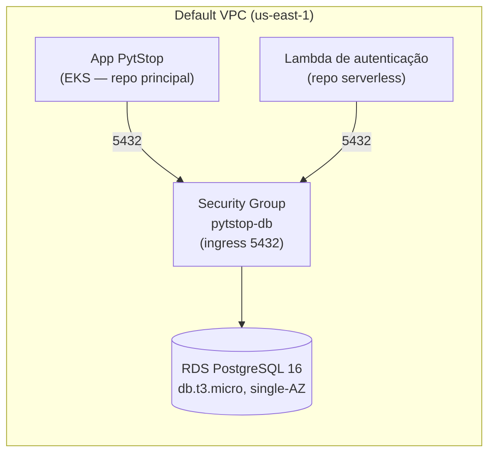

# postech-sw-arch-p3-infra-db

Infraestrutura do **banco de dados gerenciado** do PytStop (Tech Challenge FIAP — Fase 3): AWS RDS for PostgreSQL 16 provisionado via Terraform, em repositório dedicado com CI/CD conforme exigido pelo enunciado.

## Tecnologias

- **Terraform** >= 1.9, provider AWS ~> 5.x
- **AWS RDS for PostgreSQL 16** — `db.t3.micro`, single-AZ, 20GB gp3
- **AWS Academy Learner Lab** — região `us-east-1`, profile `academy`
- **GitHub Actions** — CI (fmt + validate) e CD (plan em `homolog`, apply em `main`)

## Arquitetura



O RDS reusa a **default VPC** da conta Academy (menos recursos, zero configuração de rede extra). O security group libera a porta 5432 a partir do CIDR da VPC (default) ou de CIDRs/SGs informados por variável (`allowed_cidr_blocks` / `extra_security_group_ids` — para apontar o SG dos nodes do EKS quando o repo principal o criar).

## Por que RDS PostgreSQL?

Resumo do [ADR-031 (repo principal)](https://github.com/fiap-postech-sw-architecture/postech-sw-arch-p3/blob/main/docs/arquitetura/adr/fase3/031-banco-gerenciado-rds.md): o domínio (ordens de serviço, clientes, veículos, orçamentos) é relacional e transacional; o app já roda PostgreSQL 16 desde a fase 2 (migrações Alembic prontas), então o banco gerenciado com **zero mudança de engine** é o RDS for PostgreSQL 16. `db.t3.micro` single-AZ pelo budget do Academy (ADR-026).

### Trade-offs aceitos (restrições do Learner Lab)

- **Sem Secrets Manager**: criar secrets + policies exigiria IAM/KMS, restritos no Academy. A senha entra por variável `sensitive` (tfvars local fora do git; secret do Actions no CD).
- **State local, sem backend remoto**: a conta expira e a infra é destruída pós-demo; backend S3/DynamoDB seria custo e IAM desnecessários.
- **`skip_final_snapshot` / sem `deletion_protection`**: banco efêmero por definição; o destroy pós-demo é obrigatório pelo budget.
- **Sem IAM novo**: apenas data sources; se algum recurso exigir role, usar a `LabRole` pré-existente.

## Execução local

### Validação (sem credenciais)

```bash
make gate   # terraform fmt -check + init -backend=false + validate
```

### Deploy (requer Learner Lab ativo)

Ordem multi-repo: `infra-db → infra-k8s → app (repo p3) → lambda/gateway` — o gateway precisa da URL pública do app (o ADR-033 receberá adendo).

1. **Start Lab** no AWS Academy e copie as credenciais (AWS Details) para o profile `academy` em `~/.aws/credentials` — runbook completo em `aws-academy-setup.md` no repo `postech-sw-arch-p3-docs`.
2. Copie `terraform.tfvars.example` para `terraform.tfvars` e defina `db_password`.
3. Provisione:

```bash
make plan     # revisa o que será criado
make apply    # cria o RDS (~10 min)
make destroy  # OBRIGATÓRIO pós-demo (budget do Academy)
```

Outputs: `endpoint`, `port` e `database_url` (montada **sem a senha** — o consumidor injeta o valor no placeholder `SENHA`).

## CI/CD

- **CI** (`.github/workflows/ci.yml`): fmt-check + validate em todo push/PR, sem credenciais.
- **CD** (`.github/workflows/cd.yml`): push em `homolog` → `terraform plan`; push em `main` → `terraform apply -auto-approve`. Requer secrets `AWS_ACCESS_KEY_ID`, `AWS_SECRET_ACCESS_KEY`, `AWS_SESSION_TOKEN` e `TF_VAR_DB_PASSWORD` — as credenciais do Academy **rotacionam a cada Start Lab** e precisam ser atualizadas antes de cada execução (ver comentário no topo do workflow).
- Push em `homolog` roda `terraform plan` (estágio de homologação de infra); apply automático só na `main`: com um único Learner Lab e budget mínimo, ambiente homolog duplicado de infra é inviável (adendo do ADR-033).

## Status e pendências

- ⏳ **Aguardando credenciais AWS** (Start Lab) para o primeiro `make apply` real — `make gate` verde localmente e no CI.
- Cota de GitHub Actions da organização esgotada: o CD está documentado mas a demo usa `make plan/apply` local.
- **Migração de dados/schema não é deste repo**: as migrações Alembic rodam a partir do repo principal (`postech-sw-arch-p3`) apontando a `DATABASE_URL` para o endpoint deste RDS.
- Integração fina com o EKS (SG dos nodes em `extra_security_group_ids`) depende do provisionamento do cluster no repo de infra correspondente.
- Dockerfile/Swagger: n/a — repo 100% Terraform, sem artefato conteinerizável nem API própria.
